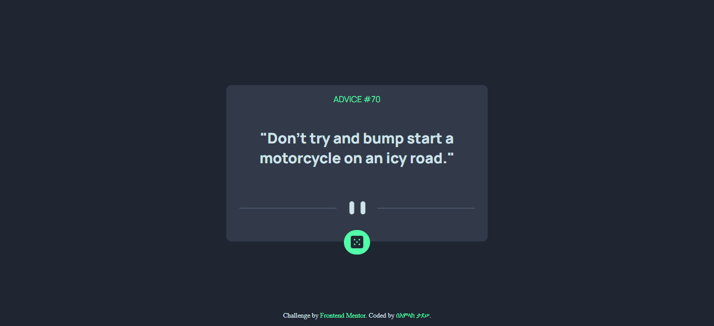
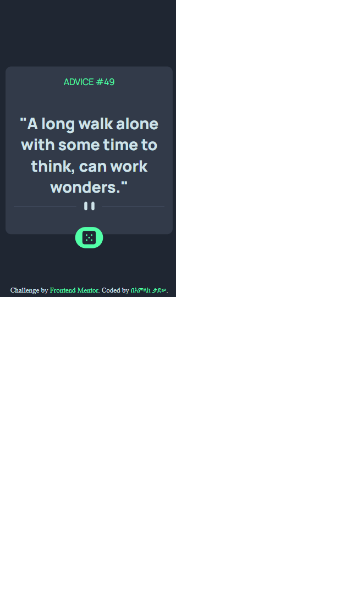

# Frontend Mentor - Advice generator app solution

This is a solution to the [Advice generator app challenge on Frontend Mentor](https://www.frontendmentor.io/challenges/advice-generator-app-QdUG-13db). Frontend Mentor challenges help you improve your coding skills by building realistic projects.

## Table of contents

- [Overview](#overview)
  - [The challenge](#the-challenge)
  - [Screenshot](#screenshot)
  - [Links](#links)
- [My process](#my-process)
  - [Built with](#built-with)
  - [What I learned](#what-i-learned)
  - [Continued development](#continued-development)
  - [Useful resources](#useful-resources)
- [Author](#author)

## Overview

### The challenge

Users should be able to:

- View the optimal layout for the app depending on their device's screen size
- See hover states for all interactive elements on the page
- Generate a new piece of advice by clicking the dice icon

### Screenshot




### Links

- Solution URL: https://www.frontendmentor.io/solutions/frontend-mentor-advice-generator-app-F5xXti72k0
- Live Site URL: https://beamlaktadesse01.github.io/Frontend-Mentor-Advice-Generator/

## My process

### Built with

- Semantic HTML5 markup
- CSS custom properties
- Flexbox
- CSS Grid
- Mobile-first workflow


### What I learned

Use this section to recap over some of your major learnings while working through this project. Writing these out and providing code samples of areas you want to highlight is a great way to reinforce your own knowledge.

To see how you can add code snippets, see below:

```js
fetch(link).then(data=>data.json()).then(data=>console.log(data))
```


### Continued development

i will be able to miinmize the api data fetching method with no repetation

### Useful resources

- [W3Schools](https://www.w3schools.com) - This helped me for understandning the box-shadow property in css.

## Author

- Website - [አሐዱ እኔ ሐበሻ በአምላክ](https://www.beamlak.herokuapp.com)
- Frontend Mentor - [@beamlakTadesse01](https://www.frontendmentor.io/profile/beamlakTadesse01)
